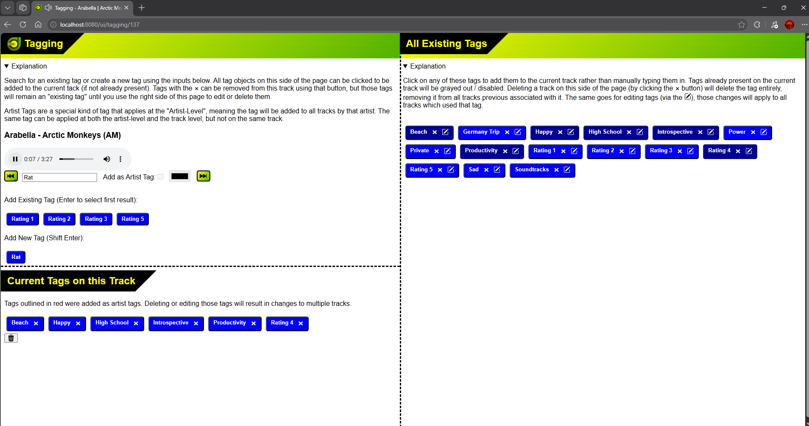
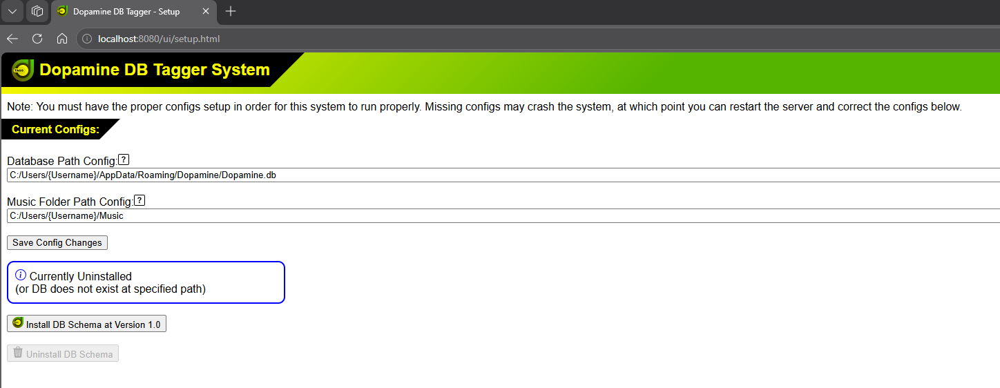
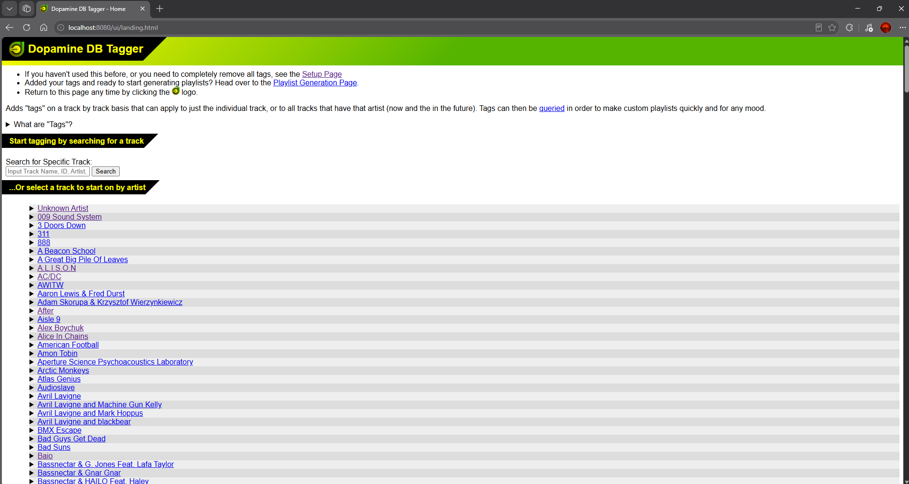
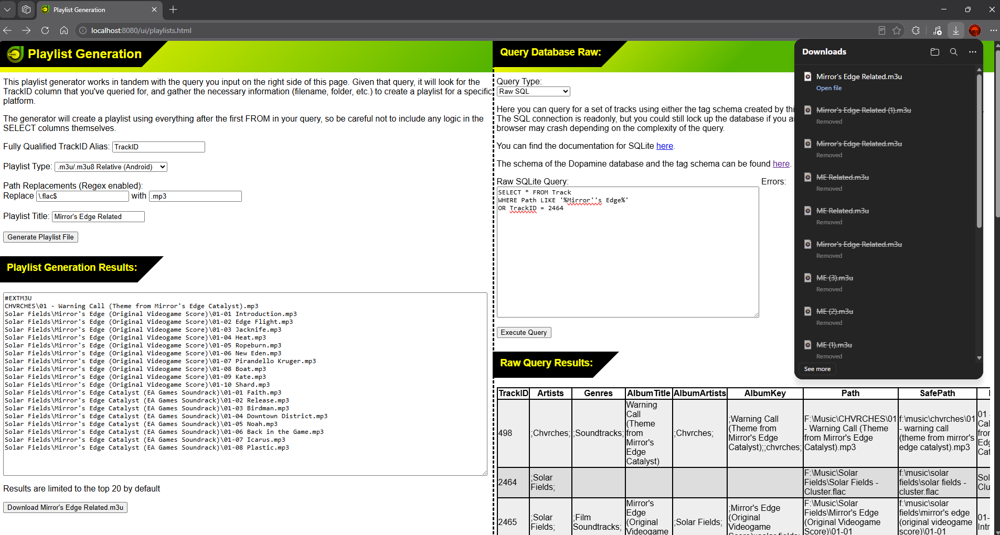

# Dopamine DB Tagger
Standing on top of the [Dopamine](https://github.com/digimezzo/dopamine) SQLite database, runs users through their tracks in various ways so that they can add more descriptors to their music. After tags are added, users can then export different queries of tags as playlist files compatible with various platforms.



## What are "Tags"?

Tags are any word that you want to associate with a track. The purpose of a tag is to classify your tracks into some other category not already defined by traditional MP3 tags (Genre, Artist, etc.). Tags could be an emotion that a track primarily evokes, a time period in which you listened to a handful of tracks, even a rating system ("Five Stars" could be a tag). The end goal of tagging is to create richer metadata on your tracks so that you can make meaningful playlists more easily. Consider the following example:

- You aquire a new album. It's a rock album that really gets your blood pumping
- You want to add this new album to all aplicable playlists
  - You have 2 playlists that this new album should be added to: "Workout", "Competitive Gaming"

Without a tag and a playlist generator, you'd have to add the track to both playlists manually, and you may forget which tracks you've added.

With a tag and playlist generator, you can add the tag "Aggressive" and create your "Workout" and "Competitive Gaming" playlists via queries similar to:
- Workout:
```
SELECT TrackID
FROM TaggedTracaks
WHERE TagName = 'Aggressive' AND TagName = 'Rock'
```
- Competitive Gaming:
```
SELECT TrackID
FROM TaggedTracaks
WHERE TagName = 'Aggressive' OR TagName = 'Electronic'
```

Now, when you use the playlist generator to re-sync the playlists, both playlists automatically pick up the new tracks. If you ever think you forgot to add tracks, you can check their tags and then re-sync the playlists to be sure they are added to the appropriate ones.
  

## Setup

You'll need to install the latest version of [Dopamine](https://github.com/digimezzo/dopamine), or you can use the one I last tested with for maximum compatibility:

> [Dopamine 3.0.5](https://github.com/digimezzo/dopamine/releases/tag/v3.0.5)

Setup [Dopamine](https://github.com/digimezzo/dopamine) as instructed to make sure it creates a database with your default music metadata in it.

You will also need to install the LTS version of [Node.js](https://nodejs.org/en/download).

You can then run the local server like so:
1. Navigate to the root of this repo in the command line
2. Run `npm install` to install dependencies
3. Run `node server.js` to start the server
4. Navigate to `localhost:8080/ui/setup.html` in any browser

5. Input the configs. There are explanations on that page but here are some details:

- `DatabaseLocation`
  - This is the location of the SQLite database that [Dopamine](https://github.com/digimezzo/dopamine) created.
  - Any tags you create will be saved to the same location, and shouldn't interefere with the [Dopamine](https://github.com/digimezzo/dopamine) program or your music metadata at all.
  - This DB is typically found at `C:/Users/{USERNAME}/AppData/Roaming/Dopamine/Dopamine.db`
- `BaseFolderPath`
  - The path to your top-level music folder, essentially whatever folder you pointed [Dopamine](https://github.com/digimezzo/dopamine) at.
  - This system currently only supports 1 `BaseFolderPath`, so if you have multiple, you will have to tag tracks in 1 particular folder at a time.
  - This essentially "mounts" the folder into the system so that the local server has access to those music files for playback

* Note that you can also modify these configs directly in `config.user.json` if an inescapable error occurs with the local server.

6. Navigate to `localhost:8080/ui/landing.html` or click the green icon in the upper left of the setup page. You should now see a list of all your music artists and a search bar. Click a link or search for a specific track and click a link to start tagging!



Happy Tagging!

## Playlist Generation

This tool, found at `localhost:8080/ui/playlists.html` can operate completely independently of the tag system, but requires the configs to be set up so that the database can be queried. The right pane of this page uses a read-only connection to let you directly query all data created by either Dopamine or this tagging system. Once a query is input and runs without error, the left pane of the page will use that query in addition to some other settings and tweaks to generate playlist files. Note that queries must have a column named "TrackID" and that column must refer to the actual `TrackID` in the Dopamine database on the `Track` table. Result previews are also available but limited to 20, then 1000 rows to avoid crashing your browser. If you need to see more than 1000 rows, you can paginate the query using typical SQLite syntax.



## Why not just add this to Dopamine?

I believe my use case is fairly nieche, and I don't think it would be worth the Dopamine developer's time to work on something like this. I could fork Dopamine as well, but that would couple this project to Dopamine much more than just using the database.